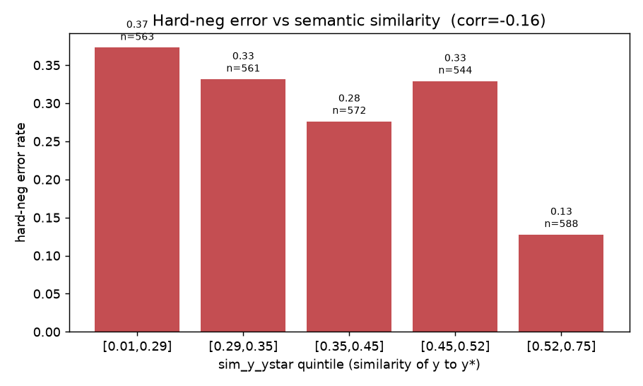
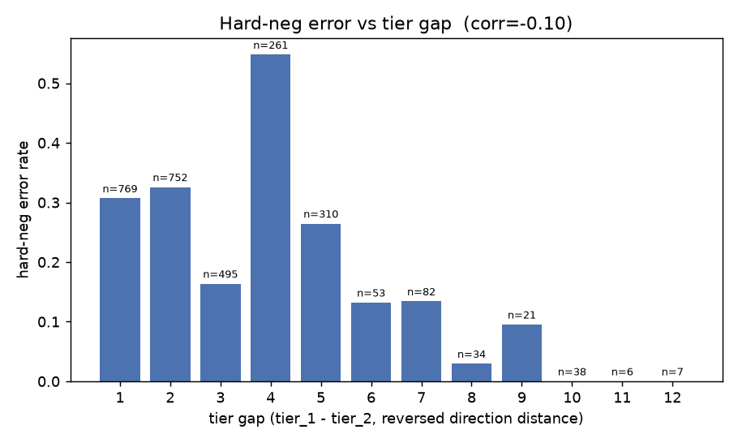
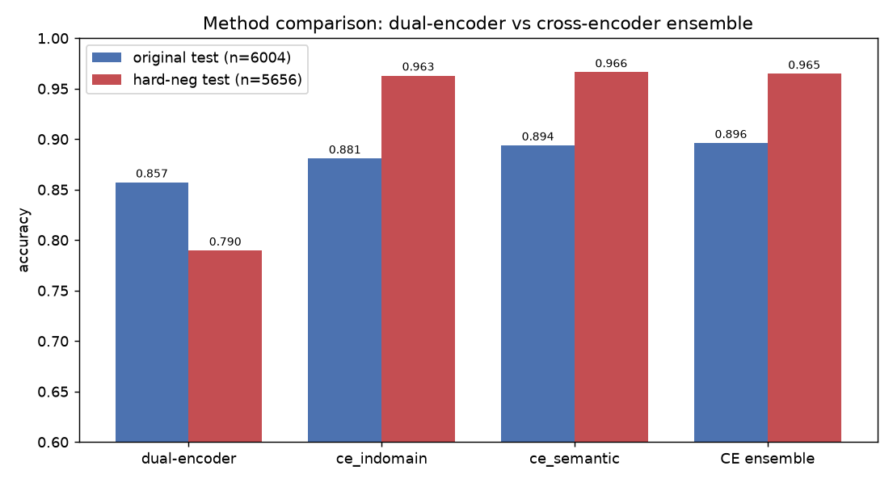
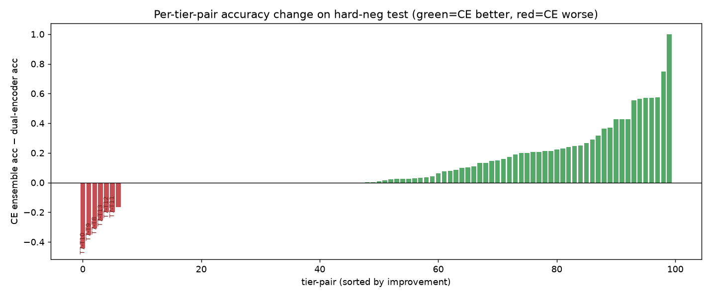

# Causal-Direction Classification — Experiment Report

**Dual-encoder (previous) vs Cross-encoder ensemble (new).** All numbers pulled directly from `runs/` metric files.

## 1. Executive summary

- The dual-encoder classifier scores **85.7%** on the original directional test but collapses to **79.0%** on the hard-negative test set — a **-6.7 pp** drop, entirely false-positives on hard negatives (pos 86.5% vs hard-neg 71.4%).
- The dip is **not** caused by semantic similarity of y vs y* (corr(sim, error) = −0.16); it is caused by **reversed-direction tier closeness** (small tier gaps), which the dual-encoder cannot judge because it embeds the two texts separately.
- The **cross-encoder ensemble** (joint x[SEP]y attention) reaches **96.5%** on the same hard-neg test — **+17.5 pp** over the dual-encoder — and **89.6%** on the original test (**+3.9 pp**).

### Headline comparison

| method | original test (n=6004) | hard-neg test (n=5656) |
|---|---|---|
| dual-encoder (previous) | 0.8571 | 0.7896 |
| **CE ensemble (new)** | **0.8961** | **0.9646** |
| improvement | +3.9 pp | **+17.5 pp** |

## 2. Datasets

Both test sets use the same directional convention: positive `x→y` has `tier(x)<tier(y)`; every negative is a **reversed-direction** pair (`tier_1>tier_2`). The hard-neg set mines, for each positive `x→y`, the chunk `y*` (with `tier(y*)<tier(x)`) most semantically similar to `y`, and adds `x→y*` as label 0.

The decisive difference is the **tier-gap distribution of negatives** (positives unchanged):

| | original (34) neg | hard-neg neg |
|---|---|---|
| adjacent (gap=1) | 377 (12.3%) | **769 (27.2%)** |
| close (gap≤2) | 939 (30.6%) | **1521 (53.8%)** |
| mean tier gap | 4.66 | **2.91** |

The hard-neg set roughly **doubles adjacent reversals** — the cases that require genuine directional reasoning.

## 3. Why accuracy dropped

From `analysis/hard_neg_analysis.md` (dual-encoder on hard-neg test):
- **Semantic similarity is NOT the cause:** corr(`sim_y_ystar`, error) = **−0.16**. The highest-similarity quintile (0.52–0.75) has the *lowest* error (0.13); fooled cases avg sim 0.37 vs rejected 0.42.
- **Tier gap is the cause:** error 0.32 at gap≤2 vs 0.09 at gap≥6.
- **Mechanism:** the dual-encoder embeds x and y in separate towers (feature `[A;B;A−B;A*B]`), so it cannot attend across the pair and is weak at direction on tier-adjacent reversals.

## 4. Methods

**Dual-encoder (previous):** two `BAAI/bge-small-en-v1.5` towers encode x and y independently; an MLP head classifies `[A;B;A−B;A*B]`. No cross-attention between x and y.

**Cross-encoder (new):** a single `bert-base-uncased` encodes the *joined* sequence `[CLS] x [SEP] y [SEP]`; the `[CLS]` vector → `Linear(768→1)`. Full token-level cross-attention lets it read the directional relation directly.

**Ensemble:** two cross-encoders trained on two hard-negative mining strategies — **semantic** (all-MiniLM cosine nearest neighbor) and **in-domain** (the dual-encoder's own most-confident wrong picks) — blended `p = 0.5·p_sem + 0.5·p_ind` (α swept on val; 0.5 optimal).

## 5. Results

### Full experiment inventory

| run | base | data | orig-test acc | hard-neg acc |
|---|---|---|---|---|
| best_mlp_bge_small (dual, baseline) | BGE-small | aep_causal_classification | 0.8571 | 0.7896 |
| mlp_bge_small_new (dual) | BGE-small | _new | 0.8496 | 0.7977 |
| mlp_bge_small_new_exponential (dual) | BGE-small | _soft_exp | 0.8759 | — |
| mlp_bge_small_new_seman (dual) | BGE-small | _semantic | 0.8854 | — |
| ce_indomain (cross) | bert-base | _hard_neg_indomain | 0.8807 | 0.9629 |
| ce_semantic (cross) | bert-base | _hard_neg_semantic | 0.8937 | 0.9662 |
| **CE ensemble (NEW METHOD)** | bert-base x2 | both | 0.8961 | 0.9646 |

### Per-tier-pair: where the cross-encoder wins (hard-neg test)

Biggest gains (CE ensemble − dual-encoder):

| tier pair | n | dual | CE ensemble | Δ |
|---|---|---|---|---|
| T1-T2 | 52 | 0.00 | 1.00 | +1.00 |
| T1-T5 | 163 | 0.25 | 1.00 | +0.75 |
| T4-T8 | 47 | 0.43 | 1.00 | +0.57 |
| T3-T10 | 7 | 0.43 | 1.00 | +0.57 |
| T4-T9 | 21 | 0.43 | 1.00 | +0.57 |
| T4-T6 | 183 | 0.44 | 1.00 | +0.56 |

Residual weakness — the cross-encoder **regresses on T7 (Journeys)** pairs:

| tier pair | n | dual | CE ensemble | Δ |
|---|---|---|---|---|
| T7-T10 | 6 | 0.67 | 0.22 | -0.44 |
| T7-T9 | 17 | 0.53 | 0.18 | -0.35 |
| T7-T8 | 83 | 0.71 | 0.40 | -0.31 |
| T7-T13 | 9 | 0.56 | 0.30 | -0.26 |
| T7-T12 | 10 | 0.40 | 0.20 | -0.20 |
| T7-T11 | 26 | 0.42 | 0.23 | -0.20 |

## 6. Qualitative samples

Full untruncated x / y (true effect) / y* (hard negative) with similarity and the dual-encoder's probability. (Cross-encoder per-example probs on the hard-neg test are not saved on disk — only aggregate CE hard-neg metrics exist — so that column is marked n/a rather than fabricated.)

### 6a. Top 3 highest-similarity hard negatives

- **sim(y, y*) = 0.7522**  |  dual-encoder hard-neg prob = **0.001** → rejected (pred=0)  |  dual prob on true x→y = 1.000  |  CE-ensemble prob on x→y*: _n/a (CE not scored per-example on hard-neg test)_
  - direction: x=tier3 → y=tier15; y*=tier1 (sub 14b→22 vs y*=2a)
  - **X (anchor):** Documentation Journey Optimizer Journey Optimizer Tutorials Configure source connectorsConfigure source connectors Configure source connectorsLearn about source connectors and how to configure them in Journey Optimizer. https://video.tv.adobe.com/v/335919?quality=12&learn=on Transcript In this video, we’ll give you a quick overview of source connectors in Adobe Journey Optimizer. Ingesting your customer data into Journey Optimizer is a critical step in building the real-time customer profile that informs and empowers the personalized experiences that you’ll orchestrate for your customers in Journey Optimizer. And source connectors, give you a set of pre-built tools for ingesting data from a wide variety of different systems of origin. From the Journey Optimizer home screen, you’ll see sources in the left navigation. Clicking on sources will take you to the source catalog screen, where you can see all of the source connectors that are currently available.
  - **Y (true effect):** Watch Unveiling Content Cards for Adobe Journey Optimizer (November 6, 2024) Learn how Content Cards deliver key updates, promotions, and messages seamlessly within your app or website, ensuring a non-intrusive user experience. Watch Harmonize Audiences in Experience Ecosystems - Federated Audience Composition in Experience Platform (October 24, 2024) Learn about Federated Audience Composition provides a comprehensive approach to audience curation and activation with Real-Time CDP and Journey Optimizer. Watch AI Bash - Unlocking the Power of AI Assistant in Adobe Experience Platform Applications and Campaign (September 26, 2024) AI-driven tools are transforming the way we engage customers and streamline workflows. Learn how Adobe's AI capabilities will accelerate your productivity. Watch Summer Spotlight - Three must try features in Adobe Journey Optimizer Supercharge your customer engagement this summer with Adobe Journey Optimizer's three features - journey experimentation, frequency capping, and multi-lingual messaging Watch API Triggered Messaging in Adobe Journey Optimizer Learn how to use REST APIs for contextual, personalized and real time transactional and marketing communications.
  - **Y* (hard negative):** We also include Adobe Experience Manager Assets Essentials, which is a lightweight digital asset manager fully embedded into Journey Optimizer to provide a simplified and consistent user interface that enables users to access, store, discover, and deliver digital assets directly to their marketing channels. And that includes instant access to shared assets within Adobe Creative Cloud and Adobe Experience Cloud apps. Journey Optimizer also includes Decision Management, which allows you to create and manage offers, eligibility rules, and other associated objects in a centralized library of offers that can be embedded in emails and other customer touchpoints to deliver targeted, personalized content. You also have Adobe Experience Platform AI and Machine Learning services, which allow you to do send time optimization to send the right message at the right time when your customer is most likely to engage, as well as take advantage of predictive engagement scores through machine learning models that can help you target your high-value customers and minimize churn risk. And all of this is built with the focus on speed, scale, and time to value.

- **sim(y, y*) = 0.7522**  |  dual-encoder hard-neg prob = **0.022** → rejected (pred=0)  |  dual prob on true x→y = 1.000  |  CE-ensemble prob on x→y*: _n/a (CE not scored per-example on hard-neg test)_
  - direction: x=tier3 → y=tier15; y*=tier1 (sub 14a→22 vs y*=2a)
  - **X (anchor):** You can preview the field group by clicking the icon. I see this group is oriented to B2B use cases, so it’s not what I want. Demographic details looks more promising. I also need Last Name in my schema too, and I can check both boxes to add them in one shot. If I decide later that I actually need more of those fields, I can select Manage Related Fields to open that view back up and check or uncheck more of those fields.
  - **Y (true effect):** Watch Unveiling Content Cards for Adobe Journey Optimizer (November 6, 2024) Learn how Content Cards deliver key updates, promotions, and messages seamlessly within your app or website, ensuring a non-intrusive user experience. Watch Harmonize Audiences in Experience Ecosystems - Federated Audience Composition in Experience Platform (October 24, 2024) Learn about Federated Audience Composition provides a comprehensive approach to audience curation and activation with Real-Time CDP and Journey Optimizer. Watch AI Bash - Unlocking the Power of AI Assistant in Adobe Experience Platform Applications and Campaign (September 26, 2024) AI-driven tools are transforming the way we engage customers and streamline workflows. Learn how Adobe's AI capabilities will accelerate your productivity. Watch Summer Spotlight - Three must try features in Adobe Journey Optimizer Supercharge your customer engagement this summer with Adobe Journey Optimizer's three features - journey experimentation, frequency capping, and multi-lingual messaging Watch API Triggered Messaging in Adobe Journey Optimizer Learn how to use REST APIs for contextual, personalized and real time transactional and marketing communications.
  - **Y* (hard negative):** We also include Adobe Experience Manager Assets Essentials, which is a lightweight digital asset manager fully embedded into Journey Optimizer to provide a simplified and consistent user interface that enables users to access, store, discover, and deliver digital assets directly to their marketing channels. And that includes instant access to shared assets within Adobe Creative Cloud and Adobe Experience Cloud apps. Journey Optimizer also includes Decision Management, which allows you to create and manage offers, eligibility rules, and other associated objects in a centralized library of offers that can be embedded in emails and other customer touchpoints to deliver targeted, personalized content. You also have Adobe Experience Platform AI and Machine Learning services, which allow you to do send time optimization to send the right message at the right time when your customer is most likely to engage, as well as take advantage of predictive engagement scores through machine learning models that can help you target your high-value customers and minimize churn risk. And all of this is built with the focus on speed, scale, and time to value.

- **sim(y, y*) = 0.7522**  |  dual-encoder hard-neg prob = **0.977** → FOOLED (pred=1)  |  dual prob on true x→y = 1.000  |  CE-ensemble prob on x→y*: _n/a (CE not scored per-example on hard-neg test)_
  - direction: x=tier4 → y=tier15; y*=tier1 (sub 8c→22 vs y*=2a)
  - **X (anchor):** Okay, here we go. I’ve received the email. Let me show you and let me click on the link. And here’s my unsubscription page and the confirmation page as well. One last thing I would like to show you.
  - **Y (true effect):** Watch Unveiling Content Cards for Adobe Journey Optimizer (November 6, 2024) Learn how Content Cards deliver key updates, promotions, and messages seamlessly within your app or website, ensuring a non-intrusive user experience. Watch Harmonize Audiences in Experience Ecosystems - Federated Audience Composition in Experience Platform (October 24, 2024) Learn about Federated Audience Composition provides a comprehensive approach to audience curation and activation with Real-Time CDP and Journey Optimizer. Watch AI Bash - Unlocking the Power of AI Assistant in Adobe Experience Platform Applications and Campaign (September 26, 2024) AI-driven tools are transforming the way we engage customers and streamline workflows. Learn how Adobe's AI capabilities will accelerate your productivity. Watch Summer Spotlight - Three must try features in Adobe Journey Optimizer Supercharge your customer engagement this summer with Adobe Journey Optimizer's three features - journey experimentation, frequency capping, and multi-lingual messaging Watch API Triggered Messaging in Adobe Journey Optimizer Learn how to use REST APIs for contextual, personalized and real time transactional and marketing communications.
  - **Y* (hard negative):** We also include Adobe Experience Manager Assets Essentials, which is a lightweight digital asset manager fully embedded into Journey Optimizer to provide a simplified and consistent user interface that enables users to access, store, discover, and deliver digital assets directly to their marketing channels. And that includes instant access to shared assets within Adobe Creative Cloud and Adobe Experience Cloud apps. Journey Optimizer also includes Decision Management, which allows you to create and manage offers, eligibility rules, and other associated objects in a centralized library of offers that can be embedded in emails and other customer touchpoints to deliver targeted, personalized content. You also have Adobe Experience Platform AI and Machine Learning services, which allow you to do send time optimization to send the right message at the right time when your customer is most likely to engage, as well as take advantage of predictive engagement scores through machine learning models that can help you target your high-value customers and minimize churn risk. And all of this is built with the focus on speed, scale, and time to value.

### 6b. Low-similarity, dual-encoder correctly rejected (prob≈0)

- **sim(y, y*) = 0.1256**  |  dual-encoder hard-neg prob = **0.000** → rejected (pred=0)  |  dual prob on true x→y = 0.734  |  CE-ensemble prob on x→y*: _n/a (CE not scored per-example on hard-neg test)_
  - direction: x=tier4 → y=tier11; y*=tier2 (sub 8b→16a vs y*=17c)
  - **X (anchor):** And, if I want, I can exclude the last event in order to target the individuals that have gone through all but the last step in the journey. In this case, they viewed a product, added it to the cart and gone to checkout, but did not complete the purchase. I can also specify time windows, either for the entire sequence, for any of the individual events, or for the time in between events. If I want, I can also add specific conditions on each of these events. For example, I want to specify that the products added to the cart were a specific type of product.
  - **Y (true effect):** Once a run started you cannot modify this run. What you can do is this phase for example has started you can duplicate complete runs. The other option that you have is if a phase is already activated you can go ahead and split the run into a new phase. What will happen you see here we have eight phases right now we’re in phase three. So if I split the run into a new phase the run number four to nine will be moved into a new phase.
  - **Y* (hard negative):** Using sandboxes, you can develop, test, and experiment with platform features without affecting your production environment, and run multiple platform-enabled applications in parallel. When you create resources, ingest data, and perform other data operations on platform, all of that activity is contained within a sandbox. When you create additional sandboxes, you’re essentially creating different, separate versions of your platform instance. Each sandbox maintains its own resources, including schemas, datasets, profiles, and more, and actions taken in one sandbox do not affect any other sandboxes. Outside of Experience Platform, support for sandboxes varies across the Experience Cloud ecosystem, such as an Adobe Target or Adobe Audience Manager.

- **sim(y, y*) = 0.1991**  |  dual-encoder hard-neg prob = **0.003** → rejected (pred=0)  |  dual prob on true x→y = 1.000  |  CE-ensemble prob on x→y*: _n/a (CE not scored per-example on hard-neg test)_
  - direction: x=tier6 → y=tier11; y*=tier4 (sub 4c→16a vs y*=8c)
  - **X (anchor):** You have to design each kind of field yourself, but since it’s just a nice flattened schema, it is not complex. The other option is to upload a DDL file. This allows you to do bulk creation. So, you can take a DDL file which looks like SQL. Using this method, you could create 15 tables at once, and then quickly just define what the relationships are between them.
  - **Y (true effect):** These are all checked closely because they are indicators of reputation of the sender, be it good or bad. Think of it this way. It is like letting a stranger in your home. Would you have reservations about someone you have never met enter your home? The answer, most likely, is yes.
  - **Y* (hard negative):** Okay, here we go. I’ve received the email. Let me show you and let me click on the link. And here’s my unsubscription page and the confirmation page as well. One last thing I would like to show you.

- **sim(y, y*) = 0.1991**  |  dual-encoder hard-neg prob = **0.000** → rejected (pred=0)  |  dual prob on true x→y = 1.000  |  CE-ensemble prob on x→y*: _n/a (CE not scored per-example on hard-neg test)_
  - direction: x=tier6 → y=tier11; y*=tier4 (sub 4a→16a vs y*=8c)
  - **X (anchor):** First, give your campaign a name. You can also add a description and tags to help organize and categorize it. These details make it easier to manage campaigns later. Next move to the actions tab. This is where you decide what happens when the campaign is triggered.
  - **Y (true effect):** These are all checked closely because they are indicators of reputation of the sender, be it good or bad. Think of it this way. It is like letting a stranger in your home. Would you have reservations about someone you have never met enter your home? The answer, most likely, is yes.
  - **Y* (hard negative):** Okay, here we go. I’ve received the email. Let me show you and let me click on the link. And here’s my unsubscription page and the confirmation page as well. One last thing I would like to show you.

### 6c. High-similarity AND dual-encoder fooled (prob≥0.5) — genuine failures

- **sim(y, y*) = 0.7522**  |  dual-encoder hard-neg prob = **0.977** → FOOLED (pred=1)  |  dual prob on true x→y = 1.000  |  CE-ensemble prob on x→y*: _n/a (CE not scored per-example on hard-neg test)_
  - direction: x=tier4 → y=tier15; y*=tier1 (sub 8c→22 vs y*=2a)
  - **X (anchor):** Okay, here we go. I’ve received the email. Let me show you and let me click on the link. And here’s my unsubscription page and the confirmation page as well. One last thing I would like to show you.
  - **Y (true effect):** Watch Unveiling Content Cards for Adobe Journey Optimizer (November 6, 2024) Learn how Content Cards deliver key updates, promotions, and messages seamlessly within your app or website, ensuring a non-intrusive user experience. Watch Harmonize Audiences in Experience Ecosystems - Federated Audience Composition in Experience Platform (October 24, 2024) Learn about Federated Audience Composition provides a comprehensive approach to audience curation and activation with Real-Time CDP and Journey Optimizer. Watch AI Bash - Unlocking the Power of AI Assistant in Adobe Experience Platform Applications and Campaign (September 26, 2024) AI-driven tools are transforming the way we engage customers and streamline workflows. Learn how Adobe's AI capabilities will accelerate your productivity. Watch Summer Spotlight - Three must try features in Adobe Journey Optimizer Supercharge your customer engagement this summer with Adobe Journey Optimizer's three features - journey experimentation, frequency capping, and multi-lingual messaging Watch API Triggered Messaging in Adobe Journey Optimizer Learn how to use REST APIs for contextual, personalized and real time transactional and marketing communications.
  - **Y* (hard negative):** We also include Adobe Experience Manager Assets Essentials, which is a lightweight digital asset manager fully embedded into Journey Optimizer to provide a simplified and consistent user interface that enables users to access, store, discover, and deliver digital assets directly to their marketing channels. And that includes instant access to shared assets within Adobe Creative Cloud and Adobe Experience Cloud apps. Journey Optimizer also includes Decision Management, which allows you to create and manage offers, eligibility rules, and other associated objects in a centralized library of offers that can be embedded in emails and other customer touchpoints to deliver targeted, personalized content. You also have Adobe Experience Platform AI and Machine Learning services, which allow you to do send time optimization to send the right message at the right time when your customer is most likely to engage, as well as take advantage of predictive engagement scores through machine learning models that can help you target your high-value customers and minimize churn risk. And all of this is built with the focus on speed, scale, and time to value.

- **sim(y, y*) = 0.7522**  |  dual-encoder hard-neg prob = **0.879** → FOOLED (pred=1)  |  dual prob on true x→y = 1.000  |  CE-ensemble prob on x→y*: _n/a (CE not scored per-example on hard-neg test)_
  - direction: x=tier5 → y=tier15; y*=tier1 (sub 10f→22 vs y*=2a)
  - **X (anchor):** Now our results have come back and I have several to choose from. I’m going to select the one that I like best and save it to my repository so I can then use the image within my email. I could use this image and the resulting content so far as is, but in my use case here, I instead want to use pre-approved brand assets exclusively. Now it’s worth noting that I could actually use the email that I’ve designed up to this point and send a proof back to my design team so that they have something to work from. But in the interest of the demo, let’s assume that I’ve already done that and I’ve gotten back a document with pre-approved messaging and content compliant to this marketing campaign.
  - **Y (true effect):** Watch Unveiling Content Cards for Adobe Journey Optimizer (November 6, 2024) Learn how Content Cards deliver key updates, promotions, and messages seamlessly within your app or website, ensuring a non-intrusive user experience. Watch Harmonize Audiences in Experience Ecosystems - Federated Audience Composition in Experience Platform (October 24, 2024) Learn about Federated Audience Composition provides a comprehensive approach to audience curation and activation with Real-Time CDP and Journey Optimizer. Watch AI Bash - Unlocking the Power of AI Assistant in Adobe Experience Platform Applications and Campaign (September 26, 2024) AI-driven tools are transforming the way we engage customers and streamline workflows. Learn how Adobe's AI capabilities will accelerate your productivity. Watch Summer Spotlight - Three must try features in Adobe Journey Optimizer Supercharge your customer engagement this summer with Adobe Journey Optimizer's three features - journey experimentation, frequency capping, and multi-lingual messaging Watch API Triggered Messaging in Adobe Journey Optimizer Learn how to use REST APIs for contextual, personalized and real time transactional and marketing communications.
  - **Y* (hard negative):** We also include Adobe Experience Manager Assets Essentials, which is a lightweight digital asset manager fully embedded into Journey Optimizer to provide a simplified and consistent user interface that enables users to access, store, discover, and deliver digital assets directly to their marketing channels. And that includes instant access to shared assets within Adobe Creative Cloud and Adobe Experience Cloud apps. Journey Optimizer also includes Decision Management, which allows you to create and manage offers, eligibility rules, and other associated objects in a centralized library of offers that can be embedded in emails and other customer touchpoints to deliver targeted, personalized content. You also have Adobe Experience Platform AI and Machine Learning services, which allow you to do send time optimization to send the right message at the right time when your customer is most likely to engage, as well as take advantage of predictive engagement scores through machine learning models that can help you target your high-value customers and minimize churn risk. And all of this is built with the focus on speed, scale, and time to value.

- **sim(y, y*) = 0.7522**  |  dual-encoder hard-neg prob = **0.688** → FOOLED (pred=1)  |  dual prob on true x→y = 1.000  |  CE-ensemble prob on x→y*: _n/a (CE not scored per-example on hard-neg test)_
  - direction: x=tier6 → y=tier15; y*=tier1 (sub 9f→22 vs y*=2a)
  - **X (anchor):** Documentation Journey Optimizer Journey Optimizer Tutorials In-app messages - OverviewIn-app messages - Overview In-app messages - OverviewUnderstand how to create and send in-app messages that are relevant to individual customers. https://video.tv.adobe.com/v/3432677/?learn=on recommendation-more-help 7e382214-bd30-4de2-bc8b-f6f6e7182305
  - **Y (true effect):** Watch Unveiling Content Cards for Adobe Journey Optimizer (November 6, 2024) Learn how Content Cards deliver key updates, promotions, and messages seamlessly within your app or website, ensuring a non-intrusive user experience. Watch Harmonize Audiences in Experience Ecosystems - Federated Audience Composition in Experience Platform (October 24, 2024) Learn about Federated Audience Composition provides a comprehensive approach to audience curation and activation with Real-Time CDP and Journey Optimizer. Watch AI Bash - Unlocking the Power of AI Assistant in Adobe Experience Platform Applications and Campaign (September 26, 2024) AI-driven tools are transforming the way we engage customers and streamline workflows. Learn how Adobe's AI capabilities will accelerate your productivity. Watch Summer Spotlight - Three must try features in Adobe Journey Optimizer Supercharge your customer engagement this summer with Adobe Journey Optimizer's three features - journey experimentation, frequency capping, and multi-lingual messaging Watch API Triggered Messaging in Adobe Journey Optimizer Learn how to use REST APIs for contextual, personalized and real time transactional and marketing communications.
  - **Y* (hard negative):** We also include Adobe Experience Manager Assets Essentials, which is a lightweight digital asset manager fully embedded into Journey Optimizer to provide a simplified and consistent user interface that enables users to access, store, discover, and deliver digital assets directly to their marketing channels. And that includes instant access to shared assets within Adobe Creative Cloud and Adobe Experience Cloud apps. Journey Optimizer also includes Decision Management, which allows you to create and manage offers, eligibility rules, and other associated objects in a centralized library of offers that can be embedded in emails and other customer touchpoints to deliver targeted, personalized content. You also have Adobe Experience Platform AI and Machine Learning services, which allow you to do send time optimization to send the right message at the right time when your customer is most likely to engage, as well as take advantage of predictive engagement scores through machine learning models that can help you target your high-value customers and minimize churn risk. And all of this is built with the focus on speed, scale, and time to value.

## 7. Conclusion

- The accuracy dip is a **directionality** failure of the dual-encoder on tier-adjacent reversed pairs — not a semantic-similarity effect.
- The **cross-encoder ensemble is the recommended method**: **96.5%** on the hard-neg test (+17.5 pp over the dual-encoder) and **89.6%** on the original test.
- Remaining work: the cross-encoder underperforms on **T7 (Journeys)** tier pairs (e.g. T7-T10 −0.44, T7-T8 −0.31) — a targeted fix (more T7 training pairs or T7-aware hard negatives) is the next step.
